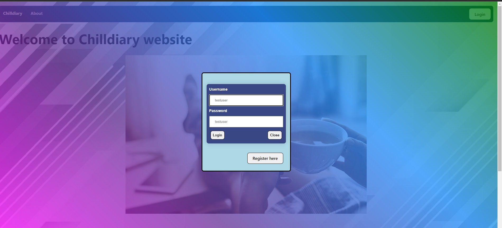
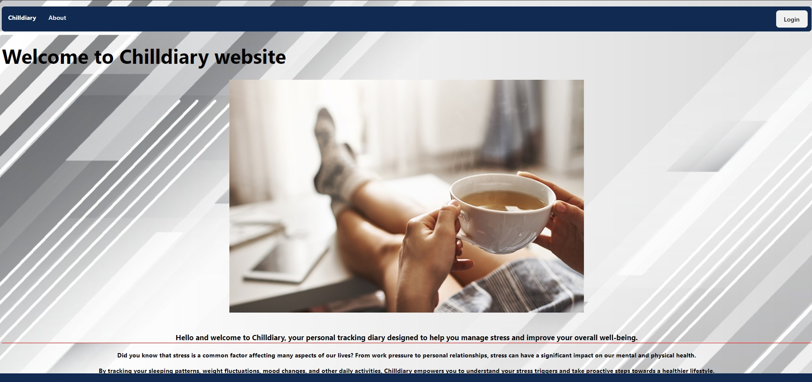
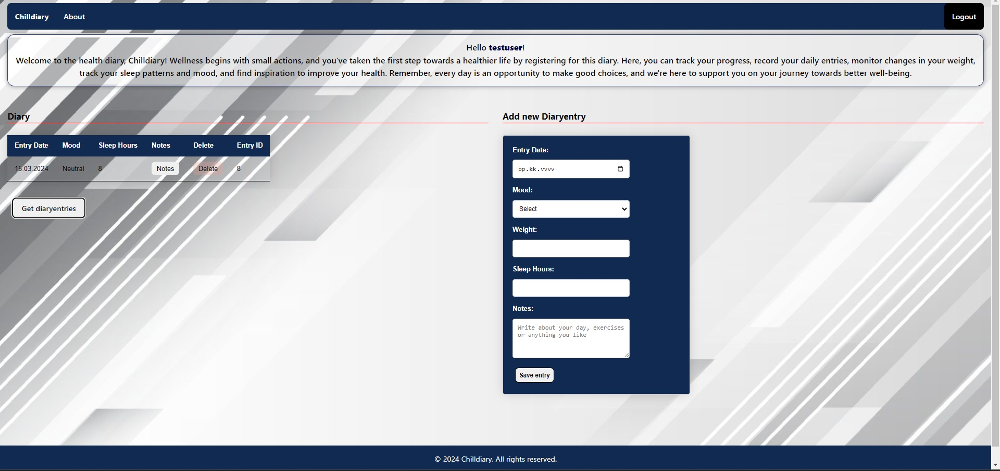

# Chilldiary

Chilldiary is a comprehensive health diary designed to help users track various aspects of their well-being and daily activities. Whether you want to monitor your sleeping patterns, weight fluctuations, mood changes, or simply jot down notes about upcoming events or training schedules, Chilldiary provides a convenient platform to do so.

## Features

- **Sleep Tracking:** Keep a record of your sleep hours to monitor your sleep patterns and quality.
- **Weight Monitoring:** Track your weight fluctuations over time to help you achieve your health goals.
- **Mood Logging:** Log your mood changes to gain insights into your emotional well-being.
- **Daily Activities:** Record your daily activities to keep track of your routines and habits.
- **Notes and Events:** Make notes about upcoming events, training schedules, or any other relevant information.

## Test User

To access the site as a test user, you can use the following credentials:

- **Username:** testuser
- **Password:** testuser

Feel free to explore the features and functionalities of Chilldiary using the test user account.

## Usage

1. **Login:** Use the provided test user credentials to log in to the site.
2. **Navigate:** Explore the different sections of the site to track your health and daily activities.
3. **Record Data:** Enter relevant information such as sleep hours, weight, mood, and daily activities.
4. **Review:** View your recorded data to gain insights into your health and well-being.
5. **Make Notes:** Use the notes section to jot down any upcoming events, training schedules, or other important information.

Chilldiary is your personal health companion, dedicated to helping you lead a healthier and happier life. Start tracking your journey to wellness today!
## Screenshots

[API Documentation](https://github.com/zymet93/healthdiary/blob/main/logs.txt)

